<h1 align="center">Hi 👋, I'm Saksham Midha</h1>
<h3 align="center">
Computer Science (AI & Data Science) Student • Full-Stack Developer • AI/ML Enthusiast
</h3>

<a href="https://saksham-midha.vercel.app/" target="_blank">🌐 Portfolio</a> •
<a href="mailto:sakshammidha1401@gmail.com">📧 Gmail</a> •
<a href="https://linkedin.com/in/saksham-midha-04b183337" target="_blank">💼 LinkedIn</a>

---

## About Me
- B.Tech student specializing in **Artificial Intelligence & Data Science** (CGPA 8.02) at MIT World Peace University, Pune
- Experience building **Full-Stack**, **Retrieval-Augmented Generation**, **Machine Learning**, **NLP**, and **Computer Vision** systems
- Former **AI/ML Intern at Corizo** — built 10+ ML models on 5,000+ record datasets with 90%+ accuracy
- Published IEEE research paper on a **WiFi-Based Proctoring System**
- Builder of **StartupForge AI**, **PathAegis**, and **AirGuard** — see pinned repos below
- Continuously learning modern technologies across AI, cloud, and full-stack development

---

## Tech Stack

### Languages

### AI / Machine Learning

### Full-Stack Development

### Databases & Cloud

### Data & Visualization

### Tools & DevOps

---

## Connect With Me

---

## GitHub Stats

